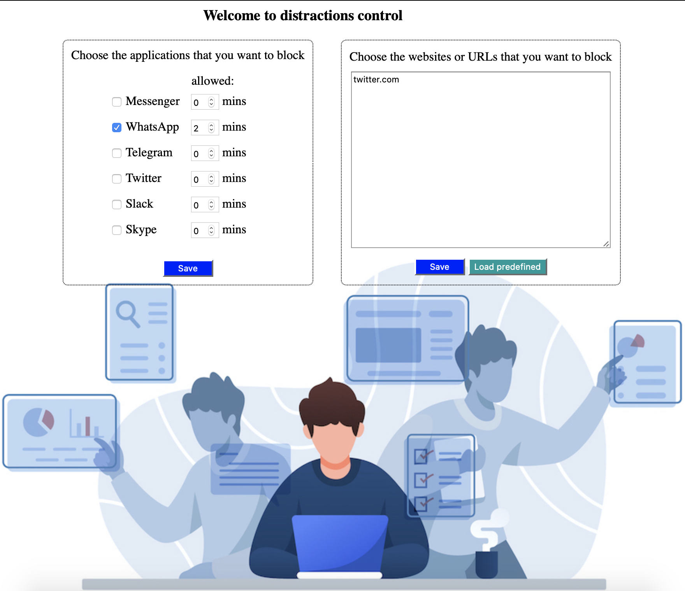
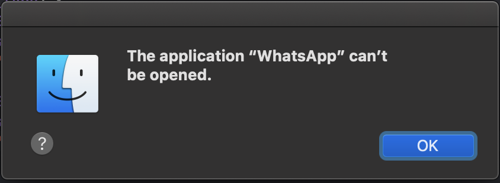

# Distractions control

The application comes to user's help by preventing the use of unproductive applications and websites.  The user is allowed to set a maximum time for usage, after which the access is not going to be allowed anymore.

The software solution is comprised of 3 main modules:
- A web application for providing the user interface, written in Vue.js and making use of Axios.
- A server implemented in Node.js, exposing an API through REST and Websockets, and persisting data to MongoDB with a Mongoose schema used to model data.
- A desktop application written in Objective-C++.  It uses Apple’s Cocoa API and deploys a daemon running in the background, handling distractions blocking. For persistence, SQLite3 is used

The web app is a [SPA](https://en.wikipedia.org/wiki/Single-page_application) where, on the left side the desired usage time for each application can be set, and on the right side URLs can be typed one on each line. 

When a prohibited app is to be opened, the following message pops up:

Same goes for restricted websites:

